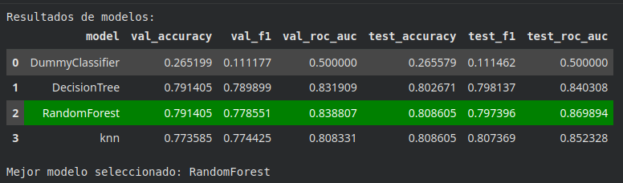
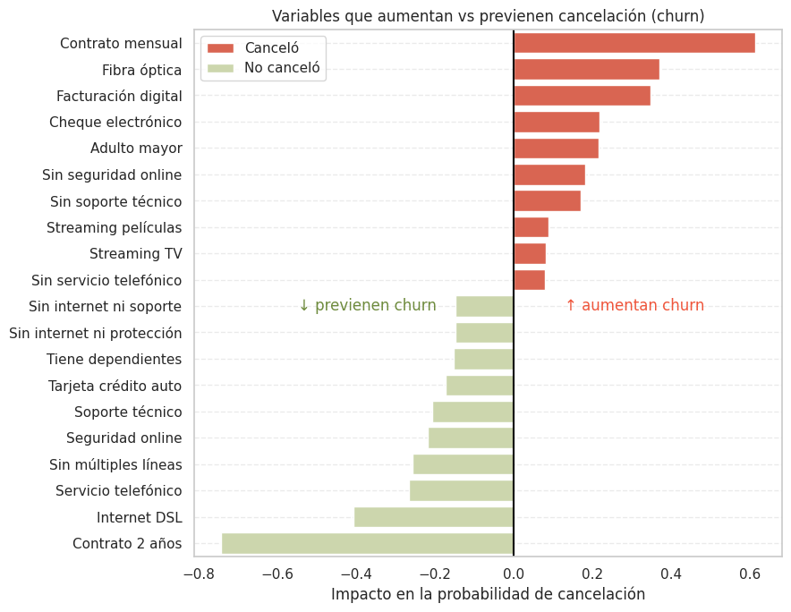

### Telecom X – Parte 2: Predicción de Cancelación (Churn)
Por Ana Berenice Noriega Camacho - 🔗 [LinkedIn](https://www.linkedin.com/in/berenice-noriega/)

Este es el tercer desafío del programa Oracle Next Education en colaboración con Alura LATAM, para especialización de Data Science. Es la continuación del desafío 2, TelecomX. 

En este, aplicados técnicas de limpieza, encoding, modelado de datos y validación de modelos de Machine Learning.

Nuestra misión era desarrollar modelos predictivos capaces de prever qué clientes tienen mayor probabilidad de cancelar sus servicios.

La empresa quiere anticiparse al problema de la cancelación, y nos correspondía elaborar un pipeline robusto para esta etapa inicial de modelado.

🧠 Objetivos del Desafío

    Preparar los datos para el modelado (tratamiento, codificación, normalización).

    Realizar análisis de correlación y selección de variables.

    Entrenar dos o más modelos de clasificación.

    Evaluar el rendimiento de los modelos con métricas.

    Interpretar los resultados, incluyendo la importancia de las variables.

    Crear una conclusión estratégica señalando los principales factores que influyen en la cancelación.

🧰 Lo que se practicó 

✅ Preprocesamiento de datos para Machine Learning
✅ Construcción y evaluación de modelos predictivos
✅ Interpretación de resultados y entrega de insights
✅ Comunicación técnica con enfoque estratégico
---
## Notebook del proyecto
El informe fue creado en un notebook de Python (.ipynb). En secciones siguientes, se explica cómo ejecutarlo para generar todas las visualizaciones. 

- El nombre del archivo es: **TelecomX_LATAM_pt2_Machine_learning.ipynb**
--

## Entorno de ejecución recomendado

Se recomienda ejecutar este proyecto en **Google Colab**, ya que el notebook contiene múltiples visualizaciones interactivas que solo se renderizan correctamente en este entorno.

Google Colab permite ejecutar el código directamente desde el navegador y **no requiere instalar Python ni librerías adicionales** en el equipo local.

### Abrir directamente en Google Colab
Pulsa el siguiente botón: 

Para usar Google Colab solo necesitas:
- Una **cuenta de Google**
- Abrir el notebook desde el botón anterior

### Cómo ejecutar el análisis

1. Abrir el notebook en **Google Colab**.
2. En el menú superior seleccionar:
Entorno de ejecución - Ejecutar todo

Esto ejecutará todas las celdas del notebook y generará **todas las visualizaciones del análisis**.

Asegúrate de tener cargado el archivo TelecomX_Data.json en la carpeta de archivos del entorno de Google Colab.

--

## Datos incluidos en el repositorio

Este repositorio incluye los datos utilizados durante el proyecto:

- **TelecomX_Data_Limpia.csv**  
  Dataset limpiada y transformada en la primera parte del desafío (TelecomX), de la cual se extraen los datos.
  - **df_encoded.pkl**  
  Dataset después del proceso de **codificación**, realizada con One Hot Encoder en este reto.
- **best_model.png y variables_churn.png**
  Las imágenes más prepresentativas, que resumen los resultados del Challenge.

Estos archivos permiten **reproducir completamente el flujo de trabajo del proyecto**.

--
# Churn Prediction Project

## 📌 Objetivo
Predecir la **cancelación de clientes (churn)** y entender las **variables más importantes** que influyen en la decisión de permanecer o cancelar, usando un pipeline completo de machine learning.

---

## 🔄 Flujo de trabajo
1. **Preparación de datos**: limpieza, codificación de variables categóricas y creación de nuevas features.  
2. **Exploración de datos (EDA)**: análisis de distribución de variables y visualización de patrones de churn.  
3. **Modelado y evaluación**:  
   - Split en train/validation/test  
   - Evaluación de varios modelos (Dummy, Decision Tree, Random Forest, KNN)  
   - Optimización de hiperparámetros mediante Grid Search con CV  
   - Selección del mejor modelo según **ROC-AUC** y **F1-score**  
4. **Interpretación**: identificación de variables que **aumentan o previenen churn** mediante un modelo logístico interpretable.  

> ✅ Todas las etapas se implementaron con **funciones modularizadas**, lo que facilita probar y comparar distintos modelos de manera reproducible.

---

## 🛠 Funciones clave del pipeline

| Función | Propósito |
|---------|-----------|
| `split_dataset(X, y, test_size, random_state)` | Divide los datos en train, validation y test de forma estratificada. |
| `cross_validate_model(model, X_train, y_train, cv_splits, scoring, random_state)` | Calcula métricas promedio usando cross-validation. |
| `select_and_validate_model(model_class, param_grid, X_train, y_train, ...)` | Realiza Grid Search con CV y devuelve el **mejor modelo** entrenado. |
| `train_and_evaluate(model, X_train, y_train, X_val, y_val, X_test, y_test)` | Entrena el modelo y calcula métricas, reportes y matrices de confusión. |
| `plot_model_results(df_results)` | Compara gráficamente métricas de distintos modelos. |
| `full_pipeline(models_dict, X, y, ...)` | Pipeline completo que ejecuta todos los pasos anteriores de manera automatizada. |
| `normalize_data(X_train, X_val, X_test, method)` | Normaliza los datos según el método seleccionado (`standard` o `minmax`). |
| `interpret_with_logistic(df_corr, target, top_n)` | Entrena un modelo logístico interpretable para identificar drivers de churn y retención. |
| `plot_churn_drivers(best_model, df_corr, target, top_n)` | Genera visualización de variables que aumentan o previenen churn. |

> 💡 Gracias a estas funciones, **cambiar de modelo, ajustar hiperparámetros y evaluar métricas** es rápido y reproducible.

---

## 📊 Resultados de modelos

> **Modelo seleccionado:** Random Forest (mayor generalización y ROC-AUC más alto).

---

## 🌟 Variables más importantes

- **Aumentan churn (rojo)**: contrato mensual, fibra óptica, facturación digital, pago por cheque electrónico, adulto mayor, sin seguridad online, sin soporte técnico.  
- **Previenen churn (verde)**: contratos a 2 años, Internet DSL, soporte técnico, seguridad online, pagos automáticos con tarjeta, dependientes, servicios adicionales.  

**Conclusión:** Incentivar contratos largos y servicios adicionales reduce significativamente la cancelación de clientes.

